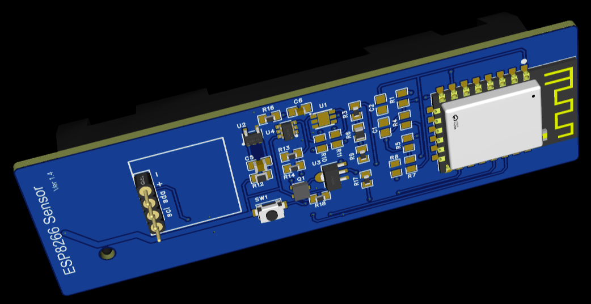
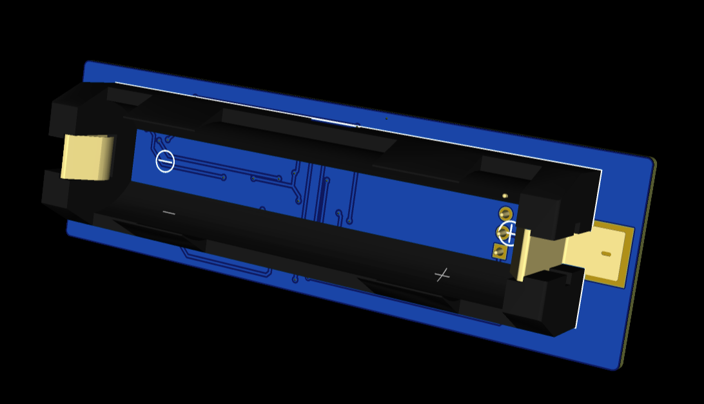
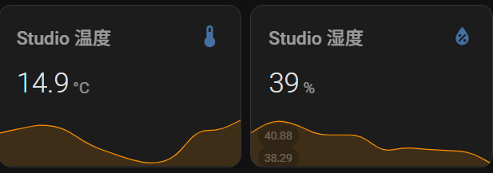

# ESP8266 温湿度传感器（SmartTS2）

> **Battery-powered ESP8266 Temperature & Humidity Sensor with MQTT & Home Assistant Auto-Discovery**
> **基于 ESP8266 的低功耗电池供电温湿度传感器，支持 MQTT 与 Home Assistant 自动发现**

------

## 📌 Project Overview | 项目概述

**SmartTS2** 是一个基于 **ESP8266 + HDC2080** 的低功耗温湿度传感器节点，专为 **Home Assistant** 设计。设备以电池供电方式运行，通过 **MQTT 自动发现** 将传感器实体注册到 Home Assistant，并在完成数据上报后通过外部电路实现真正的断电休眠。

**SmartTS2** is a **battery-powered ESP8266 sensor node** using the **HDC2080** for accurate temperature and humidity measurements. It publishes data via **MQTT** and supports **Home Assistant auto-discovery**, with an external hardware-assisted deep sleep mechanism for ultra-low power consumption.





------

## ✨ Features | 功能特性

- 🌡 **HDC2080 高精度传感器**（14-bit 温湿度采样）
- 🏠 **Home Assistant MQTT 自动发现**（无需手动配置）
- 🔋 **超低功耗设计**（外部断电式 Deep Sleep）
- 📡 **HTTP OTA 固件升级**
- 🔌 **电池电压监测**（ADC + 分压）
- 📶 **WiFi 自动重试与失败统计**
- 😊 **舒适区判断**（温湿度阈值可配置）
- 

------

## 🧰 Hardware Requirements | 硬件需求

- ESP8266 开发板（ESP-12F / NodeMCU / Wemos D1 mini 等）
- HDC2080 温湿度传感器（I2C，地址 `0x40`）
- 电池供电（需分压电阻接入 A0）
- 状态信号引脚：GPIO13（`DONE_PIN`）

------

## 📐 Sensor Specifications | 传感器参数

| Item     | Value           |
| -------- | --------------- |
| 温度范围 | -40°C ～ +125°C |
| 湿度范围 | 0% ～ 100% RH   |
| 分辨率   | 14-bit          |
| 采样频率 | 1 Hz            |

### 默认舒适区阈值 | Default Comfort Zone

- 🌡 温度：22°C ～ 28°C
- 💧 湿度：40% ～ 55%

------

## ⚙️ Configuration | 配置说明

在烧录前修改以下代码常量：

```cpp
// WiFi Configuration
const char* WIFI_SSID = "your_wifi_ssid";
const char* WIFI_PASSWORD = "your_wifi_password";

// MQTT Configuration
const char* MQTT_SERVER = "your_mqtt_broker_ip";
const int MQTT_PORT = 1883;
const char* MQTT_USER = "your_mqtt_username";     // Optional
const char* MQTT_PASSWORD = "your_mqtt_password"; // Optional

// OTA Update Server (optional)
const char* OTA_UPDATE_URL = "http://your_update_server";
```

------

## 📦 Dependencies | 依赖库

通过 **Arduino Library Manager** 安装以下库：

- ESP8266WiFi（内置）
- ESP8266httpUpdate（内置）
- PubSubClient
- Wire（内置）
- ArduinoJson（v6.x）
- HDC2080

------

## 📡 MQTT Topics | MQTT 主题说明

### 🔧 自动发现配置（Retained）

- `homeassistant/sensor/{device_name}/temperature/config`
- `homeassistant/sensor/{device_name}/humidity/config`
- `homeassistant/sensor/{device_name}/info/config`

### 📊 状态数据（State）

- `homeassistant/sensor/{device_name}/temperature/state`
- `homeassistant/sensor/{device_name}/humidity/state`
- `homeassistant/sensor/{device_name}/info/state`

------

## 🧾 Payload Format | 数据格式

### 温湿度数据 | Temperature & Humidity

```json
{
  "temperature": 23.5,
  "humidity": 45
}
```

### 设备信息 | Device Info

```json
{
  "version": "v3.8",
  "app": "SmartTS2",
  "adc_value": 850,
  "battery_voltage": 3.52,
  "wifi_rssi": -65,
  "wifi_retries": 12
}
```

------

## 🔄 Operation Flow | 工作流程

1. 初始化 GPIO 与 HDC2080
2. WiFi 连接（最多 200 次重试）
3. OTA 固件检查（可选）
4. 读取温度、湿度、电池电压
5. MQTT 发布 + Home Assistant 自动发现
6. 通过 `DONE_PIN` 通知外部电路断电

------

## 💤 Deep Sleep Design | 深度休眠机制

> ⚠️ 本项目 **不使用 ESP8266 内部 Deep Sleep**

- 数据发送完成后，GPIO13（`DONE_PIN`）输出完成信号
- 引脚先拉高一次，随后进入 **1ms 脉冲循环**
- 外部电路检测到信号后直接切断电源
- 待下次定时/触发重新上电

✔️ 几乎零待机功耗，适合长期电池供电

------

## 🏠 Home Assistant Entities | HA 实体

设备首次上线后自动生成以下实体：

- `sensor.esp8266_sensor_temperature_<mac>`
- `sensor.esp8266_sensor_humidity_<mac>`
- `sensor.esp8266_info_<mac>`

> 每个设备以 **MAC 地址** 作为唯一标识

------

## 🧾 Version History | 版本历史

- **v3.8**
  - 支持 Home Assistant MQTT 自动发现
  - 增强 WiFi 稳定性与状态上报

------

## 📄 License | 许可证

MIT 

